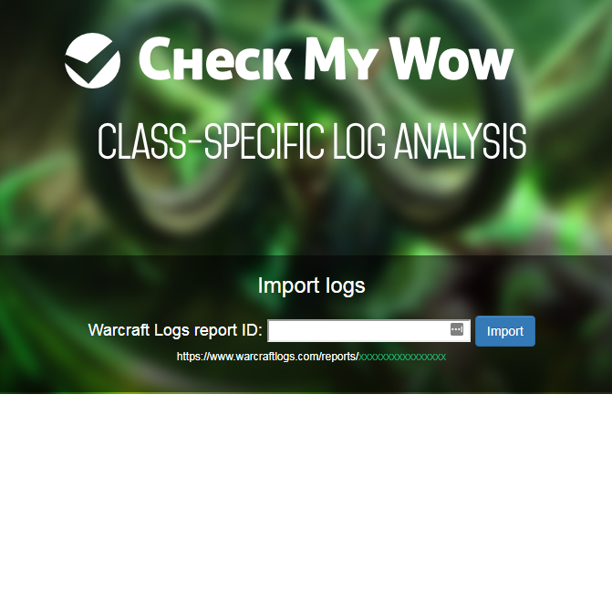

Since my day-job doesn't currently involve much programming, I like to work on fun projects on the side that let me build things directly.

## Pokemon Fusion

A simple website that replaces heads and swaps colors in Pokemon sprites.

- [Website](https://pokemon.alexonsager.net)
- Blog posts: [[behind-the-scenes-pokemon-fusion | Behind the Scenes]] and [[missingno-in-pokemon-fusion | Missingno.]]

---

## CrossPooter

Poot your toots across different platforms. It reads an RSS feed and posts new entries to GoToSocial and Bluesky.

- [[crosspooter | Blog post]]
- [Source Code](https://github.com/aonsager/crosspooter)

---

## Squirrel

A simple script that saves article text from a webpage into a local folder for archive and search.

- [[squirrel---archive-webpages-so-i-can-find-them-again| Blog post]]
- [Source Code](https://github.com/aonsager/squirrel-archiver)

---

## Check My Wow

A website (currently discontinued) that analyzes World of Warcraft combat logs and gives targeted feedback specific to the type of character you were playing.

- [Source Code](https://github.com/aonsager/checkmywow)

